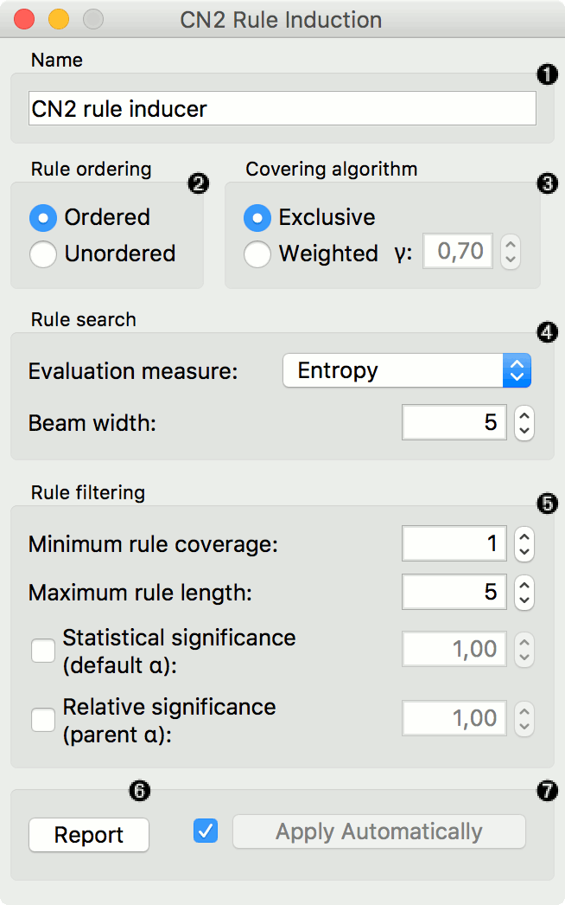
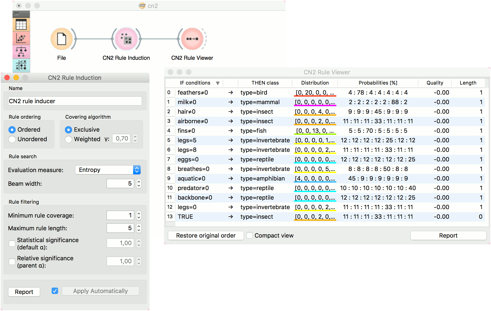
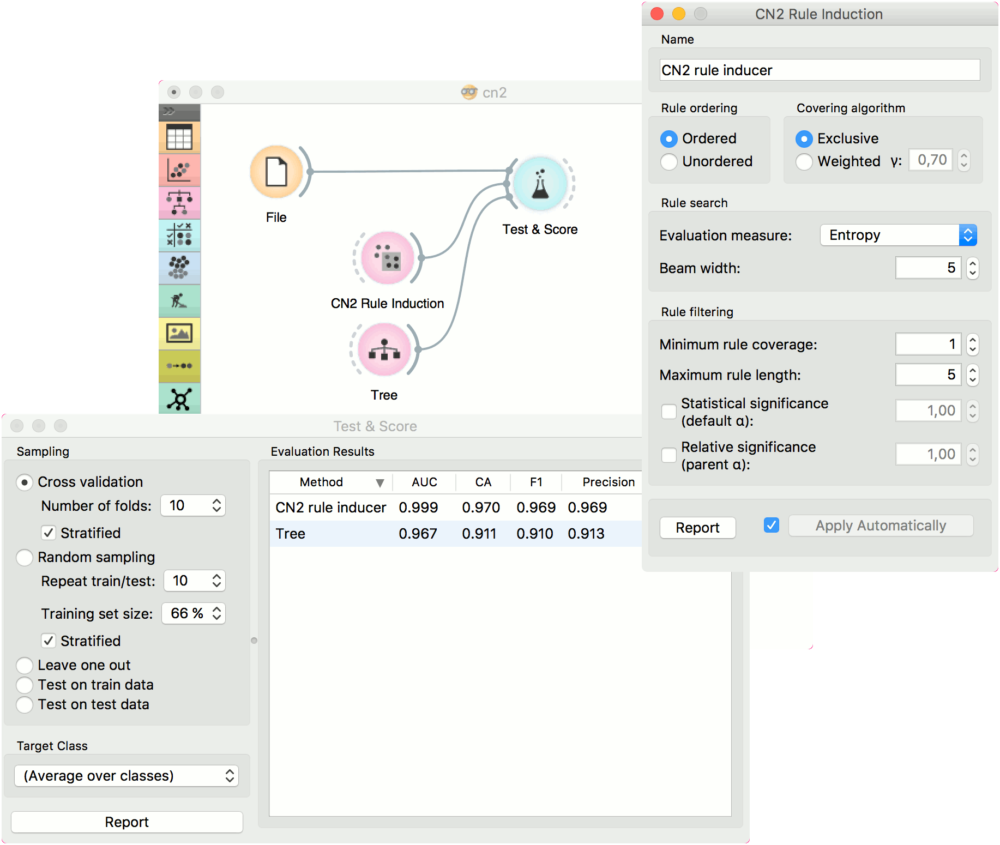

CN2 Rule Induction
==================

Induce rules from data using CN2 algorithm.

**Inputs**

- Data: input dataset
- Preprocessor: preprocessing method(s)

**Outputs**

- Learner: CN2 learning algorithm
- CN2 Rule Classifier: trained model

The CN2 algorithm is a classification technique designed for the efficient induction of simple, comprehensible rules of form "if *cond* then predict *class*", even in domains where noise may be present.

**CN2 Rule Induction** works only for classification.

1. Name under which the learner appears in other widgets. The default name is *CN2 Rule Induction*.
2. *Rule ordering*:
   - **Ordered**: induce ordered rules (decision list). Rule conditions are found and the majority class is assigned in the rule head.
   - **Unordered**: induce unordered rules (rule set). Learn rules for each class individually, in regard to the original learning data.
3. *Covering algorithm*:
   - **Exclusive**: after covering a learning instance, remove it from further consideration.
   - **Weighted**: after covering a learning instance, decrease its weight (multiplication by *gamma*) and in-turn decrease its impact on further iterations of the algorithm.
4. *Rule search*:
   - **Evaluation measure**: select a heuristic to evaluate found hypotheses:
     - [Entropy](https://en.wikipedia.org/wiki/Entropy_(information_theory)) (measure of unpredictability of content)
     - [Laplace Accuracy](https://en.wikipedia.org/wiki/Laplace%27s_method)
     - Weighted Relative Accuracy
   - **Beam width**; remember the best rule found thus far and monitor a fixed number of alternatives (the beam).
5. *Rule filtering*:
   - **Minimum rule coverage**: found rules must cover at least the minimum required number of covered examples. Unordered rules must cover this many target class examples.
   - **Maximum rule length**: found rules may combine at most the maximum allowed number of selectors (conditions).
   - **Default alpha**: significance testing to prune out most specialised (less frequently applicable) rules in regard to the initial distribution of classes.
   - **Parent alpha**: significance testing to prune out most specialised (less frequently applicable) rules in regard to the parent class distribution.
6. Tick 'Apply Automatically' to auto-communicate changes to other widgets and to immediately train the classifier if learning data is connected. Alternatively, press ‘Apply‘ after configuration.

Preprocessing
-------------

CN2 Rule Induction uses default preprocessing when no other preprocessors are given. It executes them in the following order:

- removes empty columns
- removes instances with unknown target values
- imputes missing values with mean values

To remove default preprocessing, connect an empty [Preprocess](../data/preprocess.md) widget to the learner.

Examples
--------

For the example below, we have used *zoo* dataset and passed it to **CN2 Rule Induction**. We can review and interpret the built model with [CN2 Rule Viewer](../visualize/cn2ruleviewer.md) widget.

The second workflow tests evaluates **CN2 Rule Induction** and [Tree](../model/tree.md) in [Test & Score](../evaluate/testandscore.md).

References
----------

1. Fürnkranz, Johannes. "Separate-and-Conquer Rule Learning", Artificial Intelligence Review 13, 3-54, 1999.
2. Clark, Peter and Tim Niblett. "The CN2 Induction Algorithm", Machine Learning Journal, 3 (4), 261-283, 1989.
3. Clark, Peter and Robin Boswell. "Rule Induction with CN2: Some Recent Improvements", Machine Learning - Proceedings of the 5th European Conference (EWSL-91),151-163, 1991.
4. Lavrač, Nada et al. "Subgroup Discovery with CN2-SD",Journal of Machine Learning Research 5, 153-188, 2004
