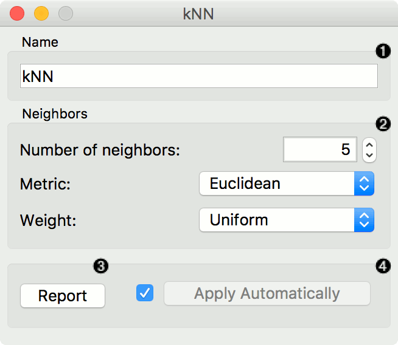
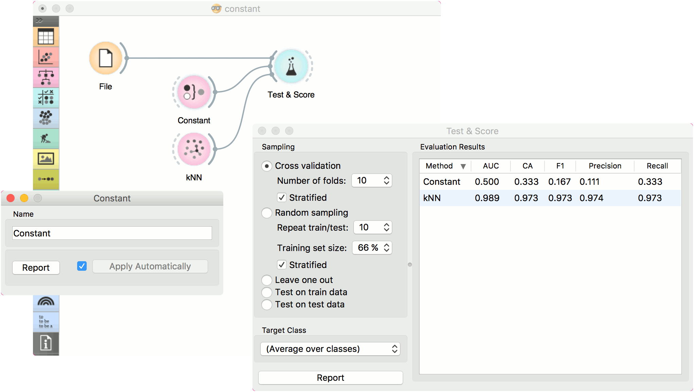
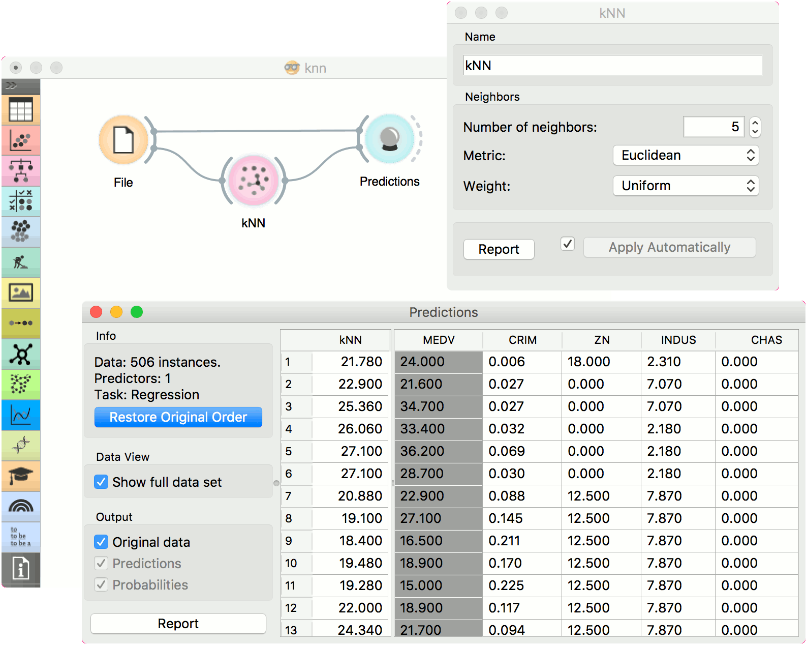

kNN
===

Predict according to the nearest training instances.

**Inputs**

- Data: input dataset
- Preprocessor: preprocessing method(s)

**Outputs**

- Learner: kNN learning algorithm
- Model: trained model

The **kNN** widget uses the [kNN algorithm](https://en.wikipedia.org/wiki/K-nearest_neighbors_algorithm) that searches for k closest training examples in feature space and uses their average as prediction.

1. A name under which it will appear in other widgets. The default name is "kNN".
2. Set the number of nearest neighbors, the distance parameter (metric) and weights as model criteria.
    - Metric can be:
        - [Euclidean](https://en.wikipedia.org/wiki/Euclidean_distance) ("straight line", distance between two points)
        - [Manhattan](https://en.wikipedia.org/wiki/Taxicab_geometry) (sum of absolute differences of all attributes)
        - [Maximal](https://en.wikipedia.org/wiki/Chebyshev_distance) (greatest of absolute differences between attributes)
        - [Mahalanobis](https://en.wikipedia.org/wiki/Mahalanobis_distance) (distance between point and distribution).
    - The *Weights* you can use are:
        - **Uniform**: all points in each neighborhood are weighted equally.
        - **Distance**: closer neighbors of a query point have a greater influence than the neighbors further away.
3. Produce a report.
4. When you change one or more settings, you need to click *Apply*, which will put a new learner on the output and, if the training examples are given, construct a new model and output it as well. Changes can also be applied automatically by clicking the box on the left side of the *Apply* button.

Preprocessing
-------------

kNN uses default preprocessing when no other preprocessors are given. It executes them in the following order:

- removes instances with unknown target values
- continuizes categorical variables (with one-hot-encoding)
- removes empty columns
- imputes missing values with mean values
- normalizes the data by centering to mean and scaling to standard deviation of 1

To remove default preprocessing, connect an empty [Preprocess](../data/preprocess.md) widget to the learner.

Examples
--------

The first example is a classification task on *iris* dataset. We compare the results of [k-Nearest neighbors](https://en.wikipedia.org/wiki/K-nearest_neighbors_algorithm) with the default model [Constant](../model/constant.md), which always predicts the majority class.

The second example is a regression task. This workflow shows how to use the *Learner* output. For the purpose of this example, we used the *housing* dataset. We input the **kNN** prediction model into [Predictions](../evaluate/predictions.md) and observe the predicted values.

