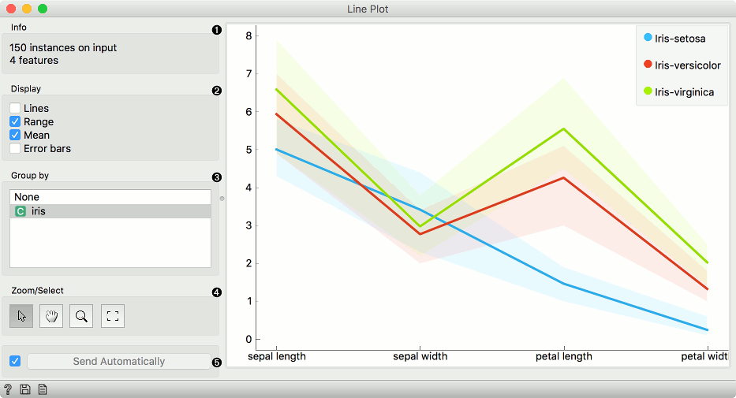
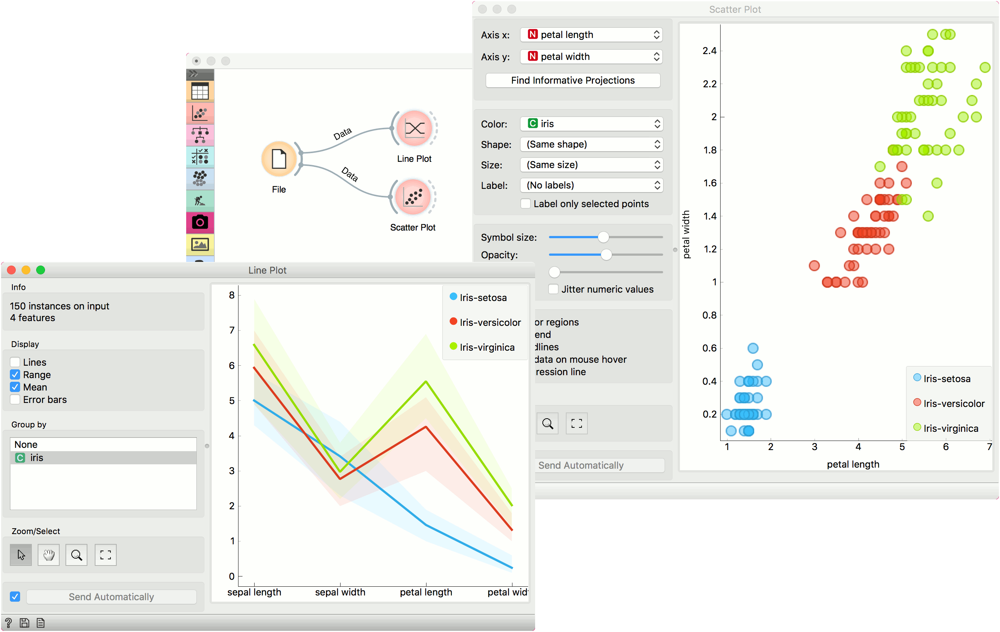

Line Plot
=========

Visualization of data profiles (e.g., time series).

**Inputs**

- Data: input dataset
- Data Subset: subset of instances

**Outputs**

- Selected Data: instances selected from the plot
- Data: data with an additional column showing whether a point is selected

[Line plot](https://en.wikipedia.org/wiki/Line_chart) a type of plot which displays the data as a series of points, connected by straight line segments. It only works for numerical data, while categorical can be used for grouping of the data points.

1. Information on the input data.
2. Select what you wish to display:
   - Lines show individual data instances in a plot.
   - Range shows the range of data points between 10th and 90th percentile.
   - Mean adds the line for mean value. If group by is selected, means will be displayed per each group value.
   - Error bars show the standard deviation of each attribute.
3. Select a categorical attribute to use for grouping of data instances. Use None to show ungrouped data.
4. *Select, zoom, pan and zoom to fit* are the options for exploring the graph. The manual selection of data instances works as a line selection, meaning the data under the selected line plots will be sent on the output. Scroll in or out for zoom. When hovering over an individual axis, scrolling will zoom only by the hovered-on axis (vertical or horizontal zoom).
5. If *Send Automatically* is ticked, changes are communicated automatically. Alternatively, click *Send*.

Example
-------

**Line Plot** is a standard visualization widget, which displays data profiles, normally of ordered numerical data. In this simple example, we will display the *iris* data in a line plot, grouped by the iris attribute. The plot shows how petal length nicely separates between class values.

If we observe this in a [Scatter Plot](../visualize/scatterplot.md), we can confirm this is indeed so. Petal length is an interesting attribute for separation of classes, especially when enhanced with petal width, which is also nicely separated in the line plot.

